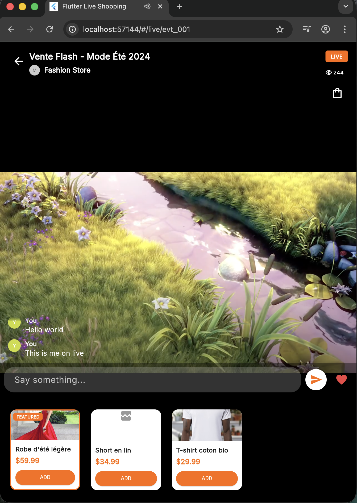

# Flutter Live Shopping 

Une application de shopping en direct (live shopping) développée avec Flutter, permettant aux utilisateurs de regarder des événements en direct, découvrir des produits, et effectuer des achats en temps réel.


##  Fonctionnalités

- **Événements en Direct** : Visionnage de streams en direct avec compteur de spectateurs
- **Catalogue de Produits** : Navigation et recherche de produits
- **Panier d'Achat** : Gestion du panier avec badge de notification
- **Processus de Checkout** : Formulaire de livraison et sélection de paiement
- **Interface Responsive** : Design adaptatif pour mobile, tablette et web
- **Animations Fluides** : Hero animations et micro-interactions
- **Optimisations Performance** : Shimmer loading, RepaintBoundary, et caching d'images
- **Accessibilité** : Support des curseurs personnalisés et feedback visuel

##  Comment Lancer l'Application

### Prérequis

- Flutter SDK 3.10.8 ou supérieur
- Dart SDK 3.10.8 ou supérieur
- Un éditeur de code (VS Code, Android Studio, IntelliJ IDEA)
- un navigateur web

### Installation

1. **Cloner le repository**
   ```bash
   git clone <repository-url>
   cd flutter_live_shopping
   ```

2. **Installer les dépendances**
   ```bash
   flutter pub get
   ```

3. **Générer les fichiers de code**
   ```bash
   flutter pub run build_runner build --delete-conflicting-outputs
   ```

### Lancement

#### Sur Web
```bash
flutter run -d chrome
```

#### Build de Production
```bash
# Web
flutter build web --release
```

##  Structure du Projet

```
lib/
├── config/              # Configuration de l'application
│   ├── router.dart      # Configuration du routing (go_router)
│   └── theme_config.dart # Thème et couleurs
├── models/              # Modèles de données
│   ├── live_event.dart  # Modèle d'événement en direct
│   ├── product.dart     # Modèle de produit
│   ├── cart_item.dart   # Modèle d'article du panier
│   ├── order.dart       # Modèle de commande
│   └── seller.dart      # Modèle de vendeur
├── providers/           # State management (Provider)
│   ├── live_event_provider.dart
│   ├── cart_provider.dart
│   └── order_provider.dart
├── screens/             # Écrans de l'application
│   ├── home/           # Page d'accueil
│   ├── live/           # Page de visionnage en direct
│   ├── product/        # Page de détails produit
│   └── checkout/       # Pages de checkout
├── services/            # Services et API
│   ├── api_service.dart      # Service API mock
│   └── websocket_service.dart # Service WebSocket mock
├── widgets/             # Composants réutilisables
│   ├── common/         # Widgets communs
│   ├── live/           # Widgets spécifiques au live
│   ├── product/        # Widgets de produits
│   └── checkout/       # Widgets de checkout
└── main.dart           # Point d'entrée de l'application

assets/
├── mock-api-data.json  # Données mock pour l'API
└── images/             # Images et ressources
    └── live_logo.png   # Logo de l'application

test/
├── api_service_test.dart      # Tests du service API
├── websocket_service_test.dart # Tests du service WebSocket
└── widgets/                    # Tests de widgets
```

##  Choix Techniques

### State Management
- **Provider** : Choisi pour sa simplicité et son intégration native avec Flutter
- Gestion d'état centralisée pour les événements, le panier et les commandes
- ChangeNotifier pour la réactivité des données

### Routing
- **go_router** : Navigation déclarative avec support des deep links
- Routes typées et navigation programmatique
- Gestion des paramètres d'URL pour le web

### Packages Principaux

| Package | Version | Utilisation |
|---------|---------|-------------|
| `provider` | ^6.1.5 | State management |
| `go_router` | ^17.1.0 | Navigation et routing |
| `cached_network_image` | ^3.4.1 | Cache et optimisation d'images |
| `shimmer` | ^3.0.0 | Placeholders de chargement |
| `google_fonts` | ^8.0.1 | Typographie personnalisée |
| `font_awesome_flutter` | ^10.12.0 | Icônes |
| `intl` | ^0.20.2 | Formatage de dates et nombres |
| `toastification` | ^3.0.3 | Notifications toast |
| `dio` | ^5.9.1 | Client HTTP (préparé pour API réelle) |
| `json_annotation` | ^4.10.0 | Sérialisation JSON |

### Architecture

- **Pattern MVVM** : Séparation claire entre UI, logique métier et données
- **Services Mock** : Simulation d'API REST et WebSocket pour le développement
- **Composants Réutilisables** : Widgets modulaires et configurables
- **Responsive Design** : Adaptation automatique aux différentes tailles d'écran

### Optimisations Performance

1. **Images** :
   - `CachedNetworkImage` pour le cache automatique
   - `RepaintBoundary` pour isoler les repaints
   - Placeholders shimmer pour une meilleure UX

2. **Widgets** :
   - Utilisation de `const` constructors
   - Lazy loading des listes
   - Hero animations pour les transitions

3. **Web** :
   - Meta tags SEO optimisés
   - Preconnect aux domaines externes
   - Loading indicator personnalisé

##  Design et UX

- **Palette de Couleurs** : Orange (#FF6B35), Bleu (#004E89), Teal (#1A936F)
- **Typographie** : Google Fonts (Inter)
- **Animations** :
  - Hero animations pour la navigation produit
  - Hover effects sur les cartes produits
  - Transitions fluides entre les écrans
- **Feedback Visuel** :
  - Curseurs personnalisés (pointer sur éléments cliquables)
  - Ombres et élévations sur hover
  - Badges de notification en temps réel


## Tests

### Lancer les Tests
```bash
# Tous les tests
flutter test

# Tests spécifiques
flutter test test/api_service_test.dart
flutter test test/widgets/widget_test.dart
```

### Analyse Statique
```bash
flutter analyze
```

### Coverage
```bash
flutter test --coverage
genhtml coverage/lcov.info -o coverage/html
open coverage/html/index.html
```


##  Screenshots

| Page d'Accueil | Événement en Direct |
| :---: | :---: |
|  |  |
| **Détails Produit** | **Panier et Checkout** |
|  |  |


##  Vidéo de Démonstration


[Voir la vidéo de démonstration](https://drive.google.com/file/d/1A9kBNZGIXWgD__xvomTjoRD4_v0nMeva/view?usp=sharing)

## License

Ce projet est sous licence MIT. Voir le fichier [LICENSE](LICENSE) pour plus de détails.

## 👥 Contributeurs

- Agyingi Jan Royal - Développeur Principal

